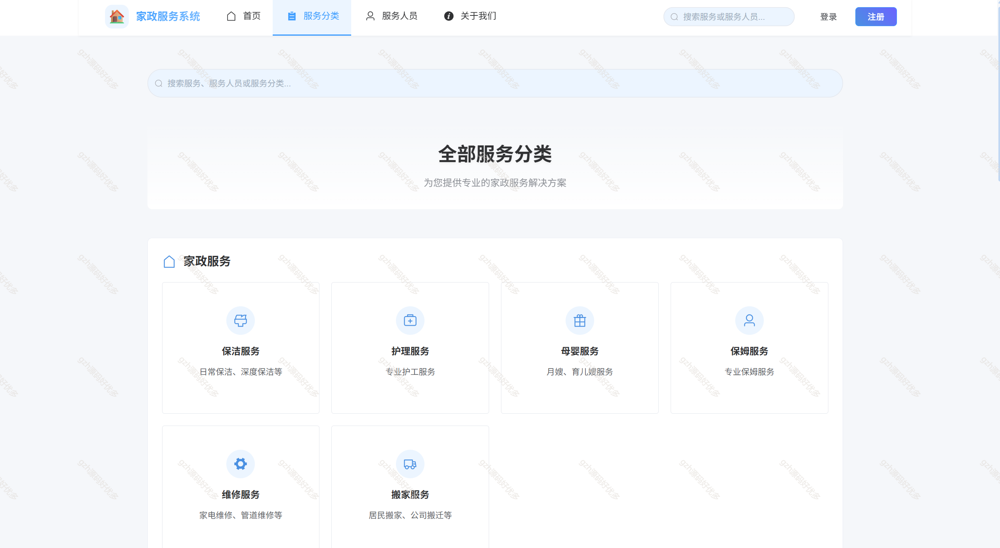
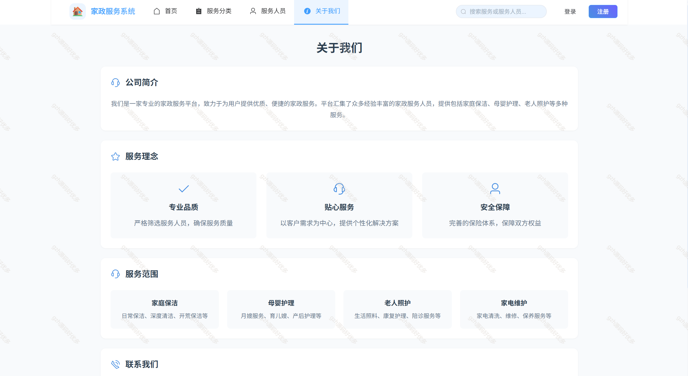
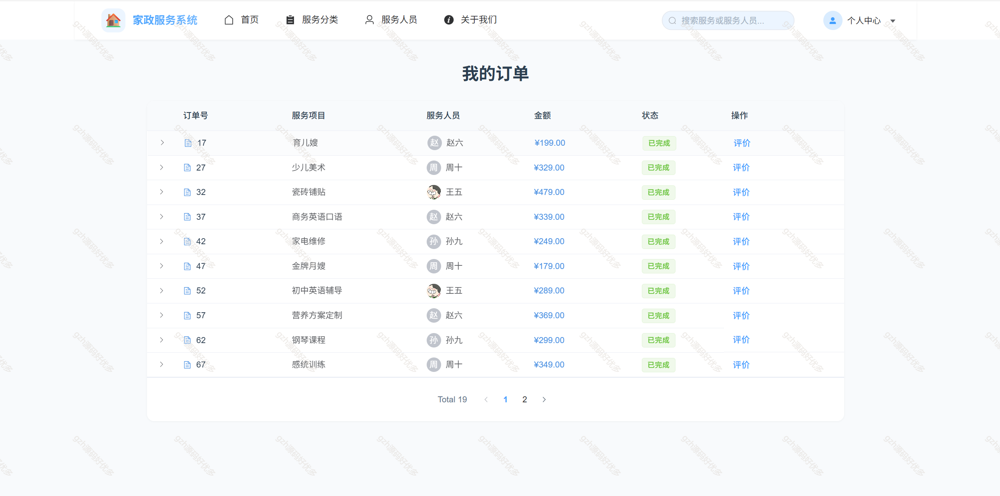
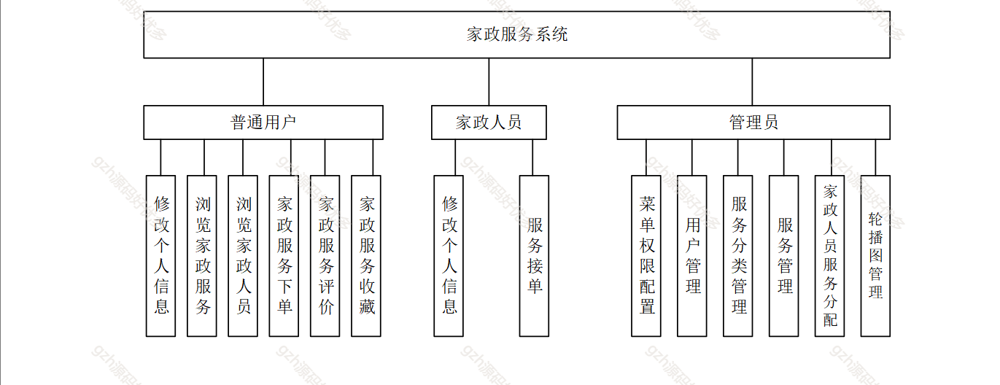
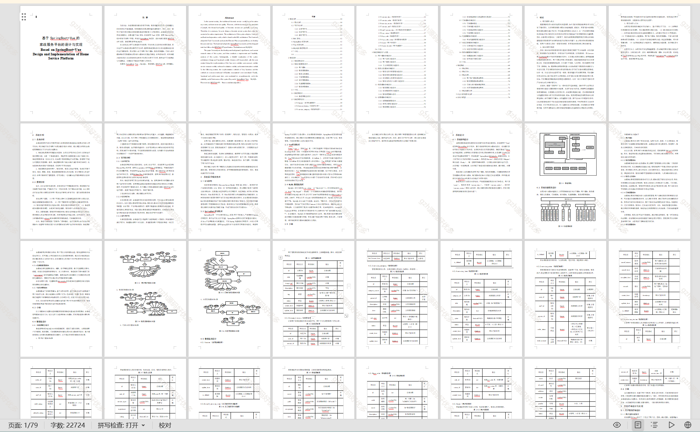
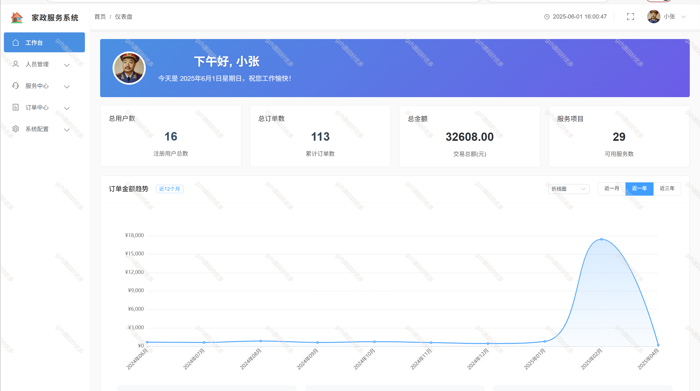
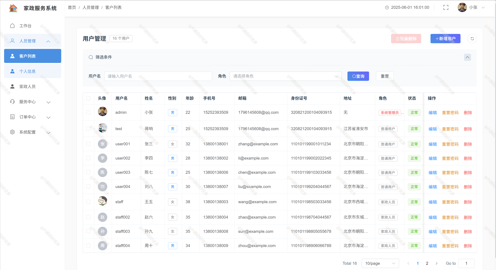
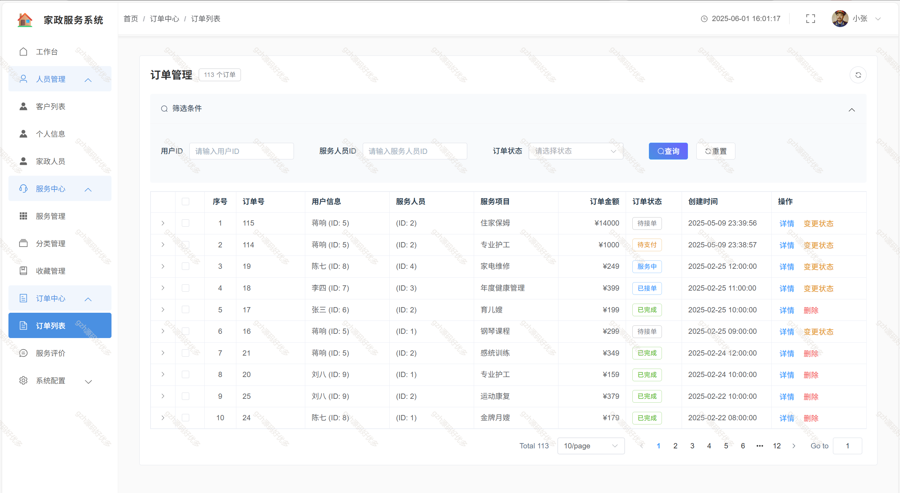
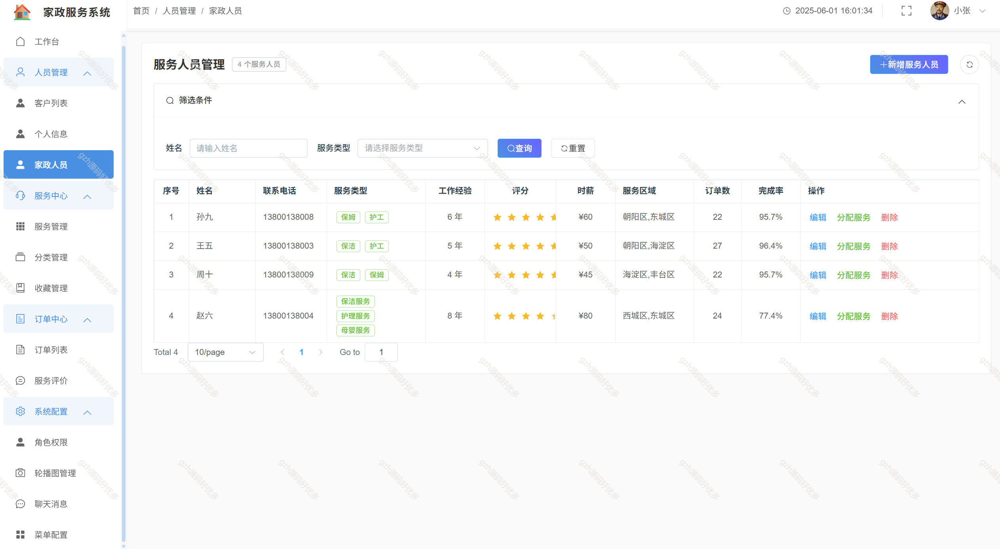

# springbootA375
springbootA375基于混合推荐算法的家政服务系统
 
## 查看主页获取源码

### 一、关键词

个性化推荐家政服务、基于混合算法的家政服务系统，家政管理系统

 

### 二、作品包含

源码+数据库+万字文档+全套环境和工具资源+部署教程

 

### 三、项目技术

前端技术：vue3 elementplus  echarts
数据库：MySQL
后端技术：Java、SpringBoot3、MyBatispuls

  
 

### 四、运行环境(以下版本亲测，其他版本未知，请自测)

开发工具：IDEA/eclipse  + vscode

数据库：MySQL8

数据库管理工具：Navicat10以上版本

环境配置软件： JDK17 + Maven3.6.3

前端Nodejs：18

浏览器：谷歌浏览器

### 五、项目介绍

项目编号：springbootA375

本系统是基于SpringBoot+Vue的家政服务管理平台，集成混合推荐算法，为用户提供智能化的家政服务推荐。。

 二、系统角色
1. 普通用户
2. 家政服务人员
3. 管理员

三、功能模块设计
1. 用户端功能模块
   1.1 个人中心
       - 用户基本信息管理
         * 隐私设置
       
       - 订单管理
        - 收藏管理
                
       - 浏览历史
        
- 评价管理
        
   
   1.2 家政服务展示
       - 服务分类浏览
       - 服务筛选功能
       - 智能推荐服务展示
         * 个性化推荐列表
         * 相似服务推荐
         * 热门服务推荐
         
   
   1.3 服务详情
       - 服务介绍   
       - 服务人员信息    
       - 价格说明
       - 在线预约功能   
1.4 订单服务
       - 预约下单流程
       - 订单状态跟踪       
       - 订单评价
         

2. 管理端功能模块
   2.1 用户管理
       - 用户信息管理
       - 用户反馈处理
   2.2 服务人员管理
       -服务人员信息管理
       - 服务能力评估
   2.3 服务管理
       - 服务类别管理
         * 类别添加/编辑
         * 服务标准制定
         * 价格体系管理
         * 服务流程管理
       - 服务质量监控
         * 服务过程监控
         * 质量评估
         * 问题跟踪
         * 改进措施
   2.4 订单管理
       - 订单状态管理
         * 订单审核
         * 状态更新
         * 异常处理
         * 订单取消处理
       - 订单分配
         * 手动分配

### 六、运行截图

